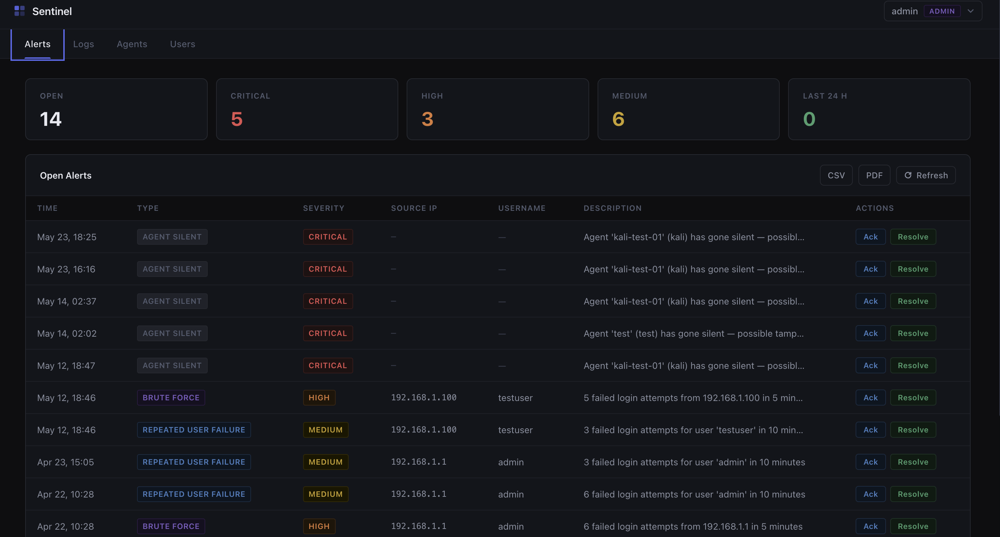
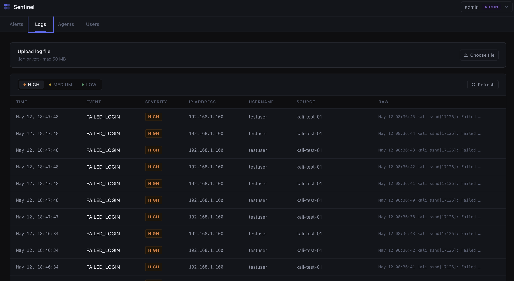
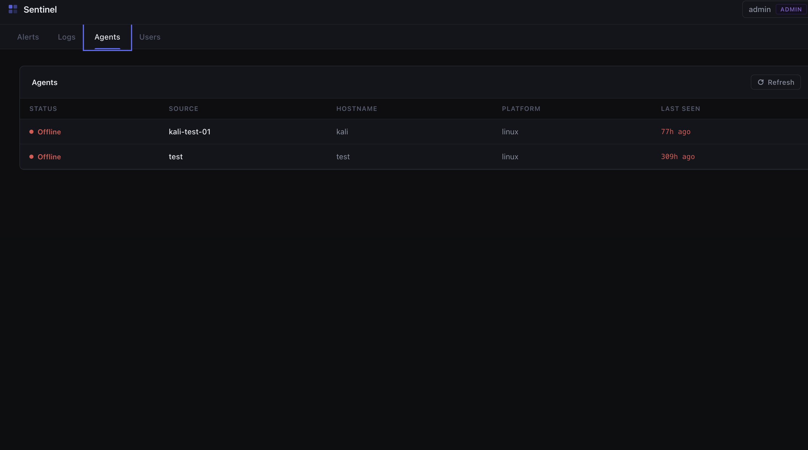
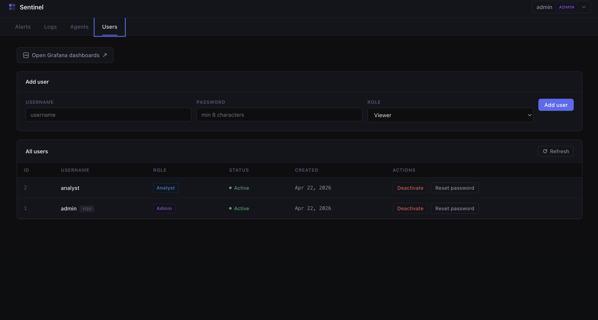
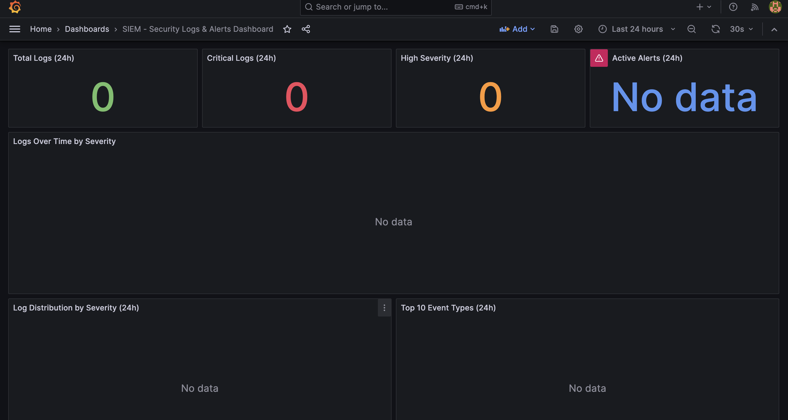
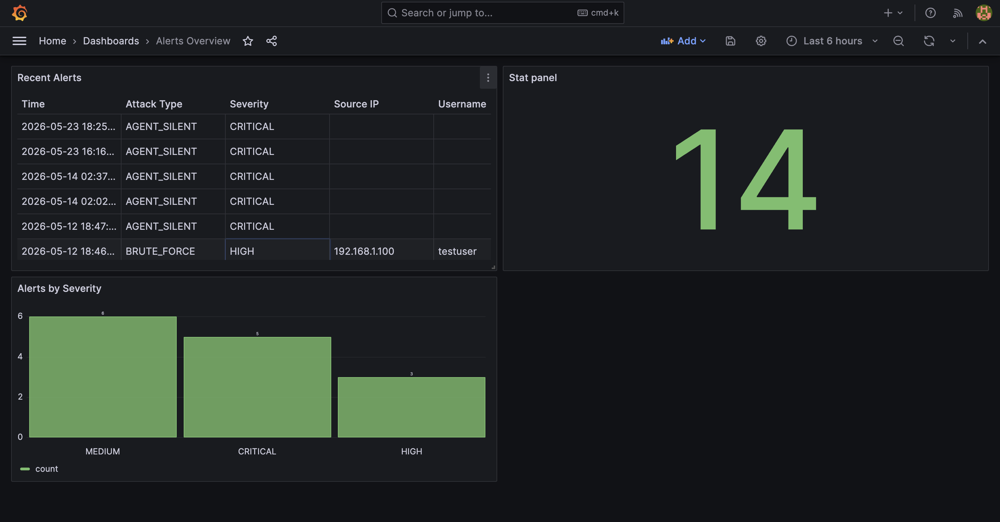

<div align="center">

<br/>


<h1>Sentinel-Logs</h1>

<p><strong>Open-source SIEM platform for real-time security monitoring, threat detection, and log analytics.</strong><br/>
Air-gapped ready. Self-hosted. No cloud dependency.</p>

<p>
  <a href="LICENSE"></a>
  
  
  
  
  
</p>

<p>
  <a href="#-quick-start">Quick Start</a> ·
  <a href="#-screenshots">Screenshots</a> ·
  <a href="#-features">Features</a> ·
  <a href="#-architecture">Architecture</a> ·
  <a href="INSTALLATION.md">Full Installation Guide</a> ·
  <a href="#-roadmap">Roadmap</a>
</p>

<br/>

</div>

---

## What is Sentinel-Logs?

Sentinel-Logs is a complete security monitoring platform you deploy on your own infrastructure. It collects logs from servers and endpoints, normalizes them, runs detection rules, and surfaces threats in a clean SOC dashboard — with no internet required.

Built for security teams, homelab operators, and developers who need real visibility without enterprise SIEM pricing.

> **Air-gapped by design.** No live demo — this platform runs on your infrastructure, not ours.

---

## Screenshots

**Alerts Dashboard** — stat cards, open alerts with Ack/Resolve, CSV/PDF export



<br/>

**Log Explorer** — filter by severity, monospace raw log view, file upload



<br/>

<table>
<tr>
<td width="50%">

**Agents** — live heartbeat status per node



</td>
<td width="50%">

**Users** — RBAC management, role assignment



</td>
</tr>
</table>

<br/>

**Grafana — SIEM Logs & Alerts Dashboard** — pre-provisioned, auto-refreshes every 30s



<br/>

**Grafana — Alerts Overview** — severity breakdown, recent alert timeline



---

## Demo & Write-up

| | |
|---|---|
| 🎬 YouTube Demo | *(coming soon)* |
| 📝 Medium Article | *(coming soon)* |

---

## Features

### 🎯 Threat Detection

| Rule | Trigger | Severity |
|---|---|---|
| SSH / RDP Brute Force | 5+ failed logins from same IP in 5 min | `HIGH` |
| Repeated Account Failure | 3+ failed attempts on same user in 10 min | `MEDIUM` |
| Privilege Escalation | `sudo`, `su`, `COMMAND=` in syslog | `CRITICAL` |
| Firewall Block | UFW / IPTables packet drop | `MEDIUM` |
| HTTP Unauthorized | 401 / 403 responses in Nginx logs | `HIGH` |

- Alert deduplication — same alert suppressed within 5 min window
- Sliding window correlation — configurable thresholds via `.env`

### 📥 Log Ingestion

- **Agent CLI** — `sentinel-logs-agent` npm package, offline queue, auto-retry on reconnect
- **REST API** — `POST /api/logs` with `x-api-key` header
- **Syslog UDP** — port 514, direct rsyslog / syslog-ng forwarding
- **File / USB upload** — batch import `.log` and `.txt` files up to 50 MB

### 🔒 Security Controls

- JWT authentication with payload integrity check against live DB
- RBAC — `admin` / `analyst` / `viewer` roles enforced per route
- Account lockout — 5 failures in 15 min → 30-min lock
- Immutable audit trail — all admin actions written to PostgreSQL with JSONB detail
- Rate limiting on all public-facing routes
- BCrypt password hashing

### 📊 Reporting & Observability

- PDF security reports — severity-colored, date-range filtered
- CSV export for forensic workflows and SIEM integrations
- Grafana dashboards — pre-provisioned via provisioning config
- Prometheus metrics endpoint (`/metrics`)
- Log statistics API — counts by severity, unique sources, unique IPs

---

## Architecture

```
┌─────────────────────────────────────┐
│     Monitored Servers / Endpoints   │
│   Linux · Windows · macOS           │
└──────────────┬──────────────────────┘
               │  HTTPS + API Key
               ▼
┌─────────────────────────────────────┐
│        Nginx Reverse Proxy          │
│     SSL/TLS Termination · :443      │
└──────────────┬──────────────────────┘
               │
               ▼
┌─────────────────────────────────────┐
│       Express.js API · :4000        │
│  Parser · Rule Engine · JWT · RBAC  │
│  Rate Limiter · Audit Trail         │
└──────────┬──────────────┬───────────┘
           │              │
           ▼              ▼
┌──────────────┐   ┌──────────────────┐
│ PostgreSQL15 │   │  Grafana Loki    │
│ Alerts       │   │  Raw Log Stream  │
│ Users / RBAC │   │  High-Volume     │
│ Audit Trail  │   │  Telemetry       │
└──────┬───────┘   └──────┬───────────┘
       └──────────┬────────┘
                  ▼
┌─────────────────────────────────────┐
│      React 19 SOC Dashboard         │
│  Alerts · Logs · Agents · Users     │
│  Grafana · PDF/CSV Export           │
└─────────────────────────────────────┘
```

---

## Stack

| Layer | Technology |
|---|---|
| Frontend | React 19, Vite |
| Backend | Node.js 20, Express |
| Database | PostgreSQL 15 (GIN indexes, full-text search) |
| Log Stream | Grafana Loki 2.9 |
| Reverse Proxy | Nginx (SSL/TLS termination) |
| Monitoring | Grafana 10, Prometheus, Promtail |
| Agent | Node.js CLI published to NPM |
| Deployment | Docker Compose |

---

## Quick Start

> For the complete guide including production hardening, air-gapped setup, and troubleshooting — see **[INSTALLATION.md](INSTALLATION.md)**

**Requirements:** Docker 20.10+, Docker Compose 2.0+, 4 GB RAM

```bash
# 1. Clone
git clone https://github.com/05tanish/sentinel-logs.git
cd sentinel-logs

# 2. Configure environment
cp .env.example .env
# Edit .env — set DB password, JWT secret, agent API key

# Generate secure secrets
openssl rand -base64 32   # for JWT_SECRET
openssl rand -hex 32      # for AGENT_API_KEY

# 3. Generate self-signed SSL certificates
cd nginx && bash generate-certs.sh && cd ..

# 4. Start all services
docker-compose up -d --build

# 5. Verify everything is running
docker-compose ps
```

Open `https://localhost` — accept the self-signed certificate warning.

### Deploy an agent on any monitored node

> Modern Linux (Kali, Ubuntu 20+) uses journalctl. Run `sudo apt install rsyslog -y && sudo systemctl start rsyslog` first to create traditional log files.

```bash
# Install globally
sudo npm install -g sentinel-logs-agent

# Run diagnostics — checks connectivity, port access, API key
siem-agent-diagnose

# Configure server URL and API key
siem-agent init

# Start monitoring
siem-agent start
```

### Air-Gapped / Offline Deployment

```bash
# On an internet-connected machine — export all images
docker save nginx:alpine postgres:15 grafana/grafana:10.0.0 \
  grafana/loki:2.9.0 grafana/promtail:2.9.0 -o siem-images.tar

# Transfer via USB to the isolated machine, then:
docker load -i siem-images.tar
docker-compose up -d --build
```

---

## Service URLs

| Service | URL | Auth |
|---|---|---|
| SOC Dashboard | `https://localhost` | admin / *(set in .env)* |
| Grafana | `http://localhost:3000` | admin / *(set in .env)* |
| API Health | `https://localhost/api/health` | public |
| Log Ingestion | `https://localhost/api/logs` | `x-api-key` header |
| Syslog Receiver | `UDP :514` | — |
| Metrics | `https://localhost/metrics` | internal |

---

## Scripts

Utility scripts are in the [`scripts/`](scripts/) directory. See [`scripts/README.md`](scripts/README.md) for full documentation.

| Script | Description |
|---|---|
| `backup.sh` | Create a compressed PostgreSQL backup |
| `restore.sh` | Restore database from a backup file |
| `setup-cron-backup.sh` | Schedule automated daily backups via cron |
| `reset-admin-password.js` | Reset the admin user password |
| `setup-logging.sh` | Auto-detect and configure rsyslog on modern Linux |

**Quick usage:**

```bash
# Backup
export DB_NAME=siem DB_USER=admin DB_PASSWORD=yourpass
bash scripts/backup.sh

# Restore
bash scripts/restore.sh sentinel-logs-backup-20260523_120000

# Reset admin password
export ADMIN_PASSWORD=NewSecurePass@123
node scripts/reset-admin-password.js

# Setup logging on modern Linux (Kali, Ubuntu 20+)
sudo bash scripts/setup-logging.sh
```

---

## Project Structure

```
sentinel-logs/
├── backend/            # Express API, rule engine, parser, auth
├── frontend/           # React 19 SOC dashboard
├── Agent/              # NPM CLI agent (sentinel-logs-agent)
├── nginx/              # Reverse proxy config + SSL cert generation
├── grafana/            # Pre-provisioned dashboards and datasources
├── scripts/            # Backup, restore, setup utilities
├── screenshots/        # UI screenshots
├── INSTALLATION.md     # Full installation guide
├── docker-compose.yml
└── .env.example
```

---

## Roadmap

- [x] Multi-format log parser — Syslog, Nginx, UFW, JSON, Windows Events
- [x] Brute-force and account failure detection
- [x] Offline-resilient agent with local queue and auto-retry
- [x] JWT auth, RBAC, account lockout, immutable audit trail
- [x] PDF and CSV report export
- [x] Grafana dashboards + Prometheus metrics
- [x] Air-gapped Docker deployment
- [x] Syslog UDP receiver (port 514)
- [x] File / USB log upload ingestion
- [x] Agent diagnostics CLI (`siem-agent-diagnose`)
- [ ] WebSocket real-time alert streaming
- [ ] Sigma rule YAML ingestion engine
- [ ] MITRE ATT&CK dashboard mapping
- [ ] Active response — auto-block attacker IPs via firewall hooks
- [ ] Multi-factor authentication (MFA)
- [ ] Kubernetes deployment support

---

## Contributing

1. Fork the repository
2. Create a feature branch: `git checkout -b feature/your-feature`
3. Commit your changes: `git commit -m 'Add your feature'`
4. Push and open a Pull Request

---

## License & Author

Distributed under the **MIT License**. See [`LICENSE`](LICENSE) for details.

**Tanish Jain** — [@05tanish](https://github.com/05tanish)

<br/>

<div align="center">

[](https://github.com/05tanish/sentinel-logs)
[](https://github.com/05tanish/sentinel-logs)

*Built for security teams that can't afford to be online.*

</div>
